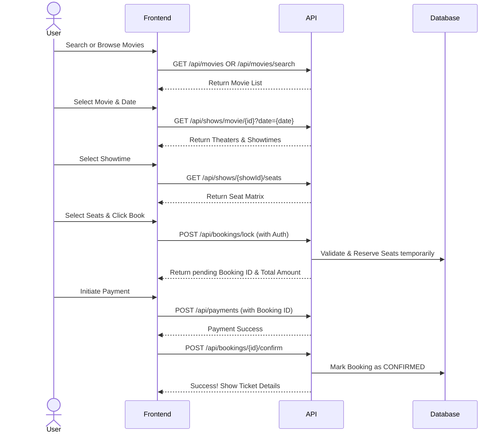

# ShowMantra Platform Architecture & System Analysis

## 1. High-Level System Summary

ShowMantra is a comprehensive movie ticket booking platform comprising a Spring Boot backend and a React (Vite) frontend. The system relies on a relational database architecture, managed via Spring Data JPA, ensuring robust transactional support for concurrent seat bookings and payments.

**Tech Stack:**
- **Backend:** Java, Spring Boot, Spring Security (JWT), Spring Data JPA
- **Frontend:** React, Vite, React Router, Axios, Zustand (State Management)
- **Database Architecture:** Relational DB with JPA entities mapped using safe constraints (e.g., UUIDs for Users and Bookings).

The system features complete end-to-end functionality including user authentication, movie browsing, theater and showtime discovery, seat layout visualization, temporary seat locking, secure payment processing, and booking management.

---

## 2. Data Models (Database Schema)

The core database schemas are structured to prevent ID enumeration (using UUIDs where sensitive) and handle high loads efficiently (using LAZY fetching).

| Entity | Primary Key | Key Attributes / Relationships |
| :--- | :--- | :--- |
| **User** | `UUID` | `email` (unique), `passwordHash`, `phone`, `role` (Enum) |
| **Movie** | `Long` | `title`, `description`, `durationMinutes`, `language`, `genre`, `releaseDate` |
| **Theater** | `Long` | `name`, `cityId`, `address` |
| **Screen** | `Long` | `theater` (ManyToOne), capacity/layout details |
| **Show** | `Long` | `movie` (ManyToOne), `screen` (ManyToOne), `startTime`, `endTime` |
| **Booking** | `UUID` | `user` (ManyToOne), `show` (ManyToOne), `totalAmount`, `bookingTime`, `status` (Enum), `items` (OneToMany) |
| **BookingItem**| `Long` | Maps a `Booking` to specific `Seat`s |
| **Payment** | `UUID` | `booking` (OneToOne), `providerReference`, `amount`, `status` (Enum) |
| **Seat / ShowSeat**| `Long` | Information regarding physical seating capacity and the locked/booked status per Show. |

---

## 3. API Catalog

The backend exposes several REST APIs used by the frontend to navigate the application state. All secure endpoints require a JWT passed via the `Authorization: Bearer <token>` header.

### User Management
- `POST /api/users/register`: Create a new user account.
- `POST /api/users/login`: Authenticate user and return JWT.

### Movies & Theaters
- `POST /api/movies` & `POST /api/theaters`: Admin endpoints to create catalog items.
- `GET /api/movies`: Retrieve movies (optionally filtered by `?cityId=X`).
- `GET /api/movies/search`: Search movies by text (`?q=keyword`).
- `GET /api/theaters`: Retrieve theaters (optionally filtered by `?cityId=X`).

### Shows & Seating
- `POST /api/shows`: Admin endpoint to schedule a show.
- `GET /api/shows/movie/{movieId}?date={YYYY-MM-DD}`: Retrieve showtimes for a specific movie on a given date.
- `GET /api/shows/{showId}/seats`: Retrieve the real-time seat matrix/layout for a specific show.

### Booking & Payment (Requires Auth)
- `POST /api/bookings/lock`: Temporarily lock selected seats. Returns a `BookingResponse` with a pending booking UUID.
- `POST /api/payments`: Process payment for the pending booking amount.
- `POST /api/bookings/{bookingId}/confirm`: Confirm booking (usually called post successful payment).
- `POST /api/bookings/{bookingId}/cancel`: Cancel a booking.
- `GET /api/bookings/history`: Retrieve the authenticated user's past/current bookings.

---

## 4. Step-by-Step Booking Flow (User Journey)

---

## 5. AI Agent Integration Points & Strategy

To build an AI agent on top of this platform, the agent can interact as a specialized client, streamlining the booking process through natural language. 

### Automatable Flows
1. **Discovery & Recommendation Agent:**
   - **Trigger:** "What action movies are playing in City X today?"
   - **Integration:** Call `GET /api/movies?cityId=X`, filter by genre locally, then call `GET /api/shows/movie/{id}` for availability.
2. **End-to-End Booking Agent:**
   - **Inputs Required:** Movie Title, Date, Time preference, Number of seats, Seat preference (e.g., "front", "back").
   - **Dependencies:** The agent must handle the sequential dependency chain: 
     `Movie ID` -> `Show ID` -> `Seat Matrix` -> `Lock Seats` -> `Payment` -> `Confirm`.

### Crucial Integration Constraints & Edge Cases
- **Authentication Dependency:** Booking endpoints demand an authenticated context (`Principal` derived from JWT). The AI agent must securely handle user credentials or operate via an API key bound to a user context.
- **Seat Concurrency (Race Conditions):** Two agents (or users) might try locking the same seat simultaneously. The AI must gracefully handle `409 Conflict` or seat lock failures from `POST /api/bookings/lock` and suggest alternative seats.
- **Payment Abstraction:** If the AI is performing unattended booking, it needs a mechanism to bypass or auto-confirm the payment gateway step (`/api/payments`) without rendering a frontend UI.
- **UUID Usage:** The AI must correctly parse and retain UUIDs (e.g., `bookingId`) throughout the transactional flow, as sequential guessing is impossible by design.
